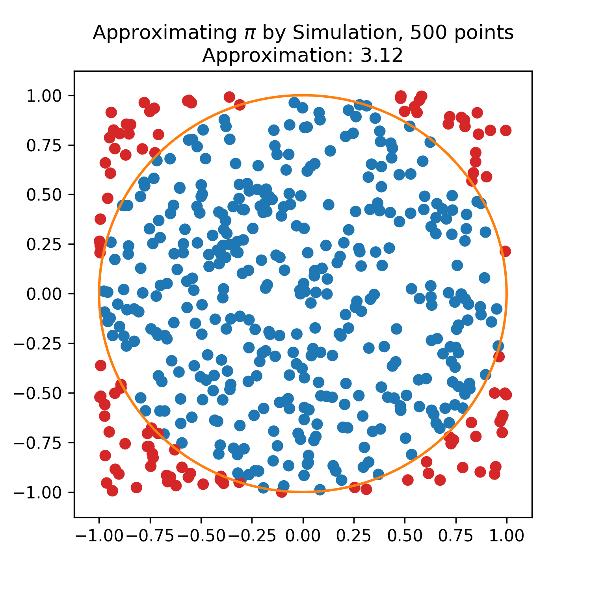
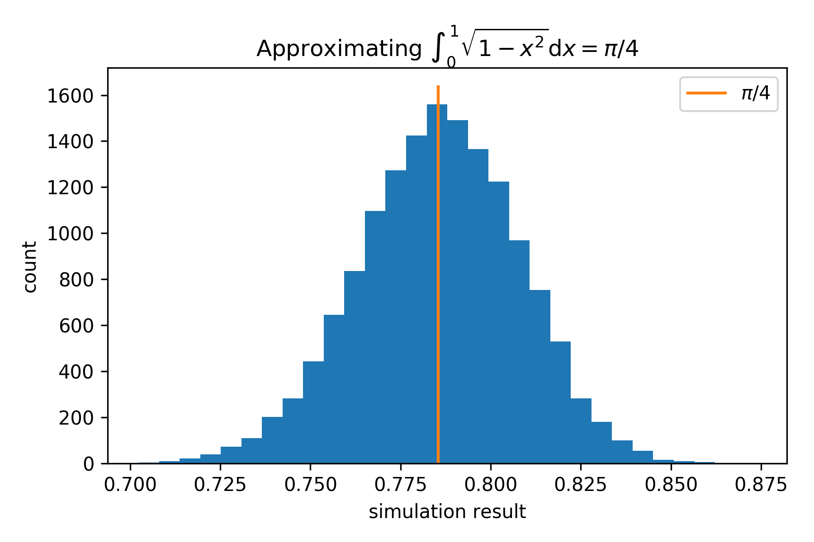
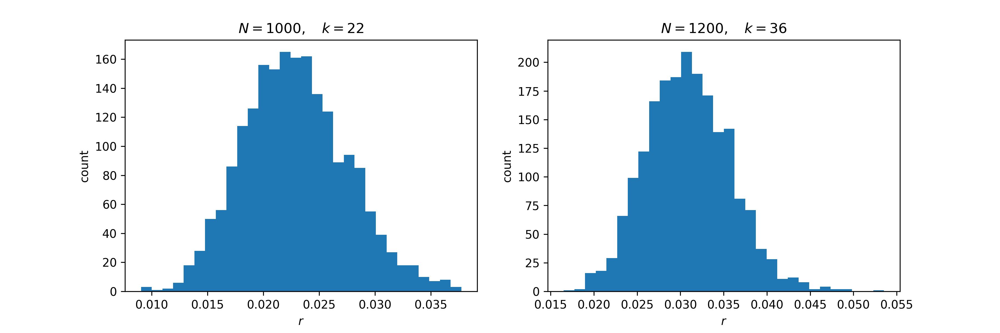
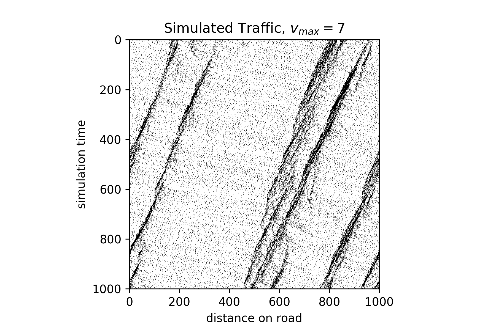
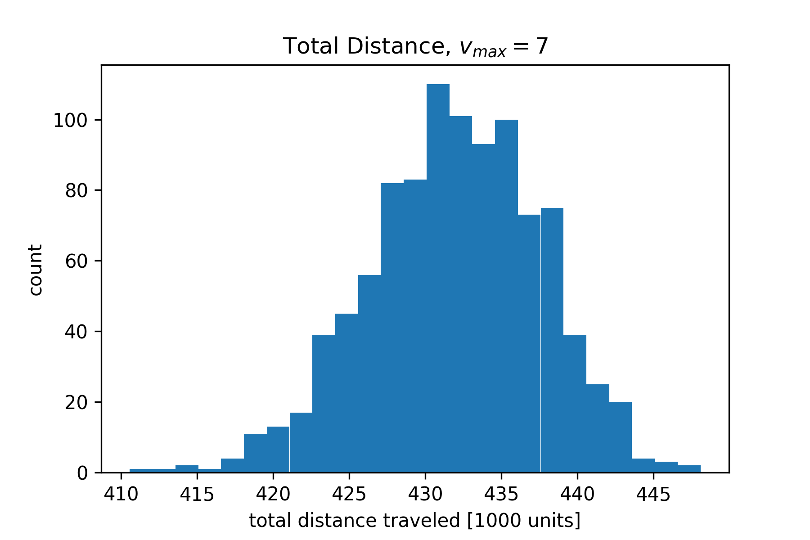
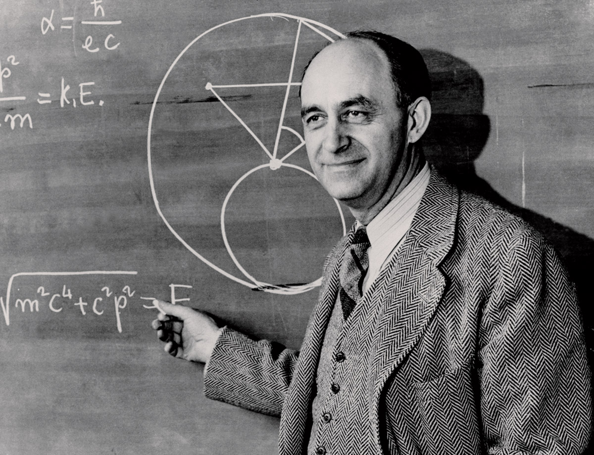

% Forecasting At Scale
% Monte Carlo Simulations With Apache Spark
% Dirk Hesse   *Chief Data Scientist at AIA Science*

# Outline

- Monte Carlo Simulations
    - What are they good for?
    - How to use them?
- Apache Spark
    - What is Spark?
    - Why should I use Spark?
- Simulating Stop and Go Traffic.
    - The Nagel-Schreckenberg model.

---

# About Me

- Background in **physics**.
    - Computational particle physics.
    - Large scale MCMC QCD simulations.
    - PhD from Humboldt University, Berlin.
- Move to industry.
    - Some software/simulation work in Roxar.
    - Data Science consulting.
    - Chief Data Scientist, AIA Science.

[\@NotDirkHesse](https://twitter.com/NotDirkHesse?lang=en)

[data-adventures.com](https://data-adventures.com)

---

# Monte Carlo Methods

> Monte Carlo methods (or Monte Carlo experiments) are a broad class
> of computational algorithms that rely on repeated random sampling to
> obtain numerical results. Their essential idea is using randomness
> to solve problems that might be deterministic in principle.

<small>Source: Wikipedia</small>

---

# Monte Carlo Approximation of Pi

<table>
<tr>
<td style="padding: 0">

<td style="padding: 0; width: 30vw">
- Throw balls in a $2\times2$ box.
- Count the fraction of balls that fall into *unit circle*.
- $\operatorname{P}(X^2 + Y^2 < 1) = \pi / 4.$
</table>

---

# A Little Theory

Instead of

$$E[f] = \int f(x) p(x) \mbox{d} x,$$

we calculate

$$\hat \mu_f = \frac 1 N \sum_i f(x_i),$$

with the $x_i$ distributed according to $p(x)$, i.e. $\mathcal{U}(-1,
1) \times \mathcal{U}(-1, 1)$ in our example.

---

# Approximating Pi, Many Times

---

# One More Example

## A/B Testing

<table>
<tr>
<th>Variant <th> Impressions <th> Clicked <th> Conv. rate
<tr>
<td>A <td> 1000<td> 22 <td> 2.2 %
<tr>
<td>B <td> 1200<td> 36 <td> 3.0 %
</table>

But is it *significant*? What about **confidence intervals**?

---

# Math Warning!

Hit rate $r$, $N$ impressions, $k$ hits.

$$\newcommand{P}{\operatorname{P}}\begin{eqnarray}
\P(r | \mbox{data}) &\propto& \P(\mbox{data} | r) \P(r) 
\propto r^k (1 - r)^{N-k} \mathcal{U}(0, 1)\\
&\propto& \operatorname{Beta}(k + 1, N - k + 1)
\end{eqnarray}$$ 

---

# Who is Using Monte Carlo?

<table>
<tr>
<td>
- Physics.
    - Particle physics.
    - Material science.
- Engineering.
    - Geostatistics.
- AI
     - Finding the best move in a game.
</td><td>
- Finance.
    - Option pricing.
    - Asset modeling.
    - Insurance pricing.
- Search and Rescue.
     - Find best search patterns.
- Climate change forecasting
</tr>
</table>

---

# Apache Spark

> Apache Spark™ is a fast and general engine for large-scale data
> processing. 

<small>Source: [http://spark.apache.org](http://spark.apache.org)</small>

---

# Spark Overview

<table>
<tr>
<td>
- In-memory mapreduce.
- Machine Learning.
- Data Streaming.
- DataFrames/SQL.
- Graph Processing.
<td>

</tr>
</table>

Set *world record* for the *cheapest sort* at **$1.44/TB** in
Nov. 2016, on *Amazon EC2*!

---

# Why Do Monte Carlo on Spark?

- Spark is usually used to *process* large data quantities. We use it
  to **produce** data.
- Sometimes we need to repeat a simulation many times, scanning a
  *parameter space*.
    - Easy to parallelize.
- Spark provides.
    - Easy to use framework.
    - Reliability.
    - Availability.

---

# Modeling Traffic

---

# The Nagel-Schreckenberg Model

- Road with $N$ spots, $k$ occupied by cars.
- Discrete simulation time steps $t \rightarrow$ discrete speeds.
- Speed limit $v_{max}$ units.
- Simple rules:
    1) If going slower than $v_{max}$, accelerate by 1 unit.
    2) If getting too close to the car in front, decelerate by enough
        units to avoid a crash.
    3) With a given probability $p$, reduce the speed by 1 unit.

---

# Simulation Results

---

# Simulation Results - VMT

---

# Questions?

<table>
<tr>
<td style="padding: 5vw">
 *Before I came here I was confused about this subject. Having listened
 to your lecture I am still confused. But on a higher level.*
 

 <small>Enrico Fermi</small>
<td style="padding: 5vw">
{style="width: 40vw"}
</table>
